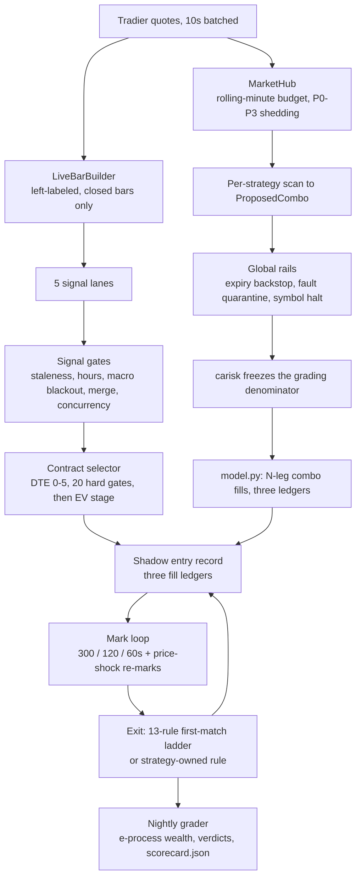

# shadow-options-trading-lab

**Live-data options strategies that trade on paper only, graded on the worst fill they could have gotten.**

[](https://github.com/csnyder256/shadow-options-trading-lab/actions/workflows/ci.yml)


-critical?style=flat-square)


This is a snapshot in time. It is a work in progress. It is currently running roughly 20 strategies in unison in shadow-mode options trading, for fine-tuning.

ATLAS is a self-hosted options research platform. On live 1-minute market data it decides what options position it *would* open, tracks that hypothetical position mark by mark, decides when it *would* close, and writes every step to append-only ledgers. It places no broker orders.

The point is not a trading bot. The point is an apparatus that can honestly tell you whether a strategy has an edge, and that refuses to flatter itself while doing it. The apparatus exists. The verdict does not.

> Companion project: [**option-contract-grader**](https://github.com/csnyder256/option-contract-grader) is the standalone, single-contract version of the valuation logic used here. Give it one contract and it tells you what it thinks the contract is worth and why. This repo is the system that acts on that kind of judgment, at scale, without spending money.

> If you read one file, read [`atlas/strategy_lab/grading.py`](atlas/strategy_lab/grading.py). It argues its own statistical validity in the docstring, including the clip it considered and rejected.

---

## The first thing to understand: it cannot trade

Shadow mode here is not a flag. There is no code path anywhere in the options import closure that can submit an order. Not a disabled one. Not one behind a boolean. The order-placement machinery from the project's earlier equity phase was deleted from the tree, not disabled. Going live would be a build, not a flip.

That claim is mechanically enforced. A test spawns a clean subprocess, imports the whole live decision path the way production imports it, and asserts that none of the archived order machinery came back:

```python
# tests/test_keep_imports.py::test_no_order_machinery_reachable_from_options
banned = [b for b in ('atlas.execution.order_lifecycle',
                      'atlas.execution.broker_adapter', 'atlas.execution.guardian',
                      'atlas.execution.robinhood_adapter', 'atlas.execution.rh_mcp_client',
                      'atlas.orchestrator', 'atlas.app')
          if b in sys.modules]
assert not banned, f'order machinery reachable: {banned}'
```

The subprocess is the load-bearing part. Inside a shared pytest process, `sys.modules` is polluted by whatever a sibling test imported first, so the same check would pass vacuously.

The main shadow's entire side-effect surface is four append-only JSONL paths (entries, marks, exits, and the per-day quote log), stated at the top of `atlas/options/shadow.py`.

## The problem

Anyone can write a strategy that looks profitable. The hard part is the measurement, and retail-grade tooling gets the measurement wrong in four specific ways:

1. **Optimistic fills.** Backtests assume you got the mid. You did not. On a wide options book that assumption alone can manufacture the entire edge.
2. **Peeking.** You check the P&L every night, and you stop when it looks good. Classical significance testing is invalid the moment you look more than once.
3. **Tuning that launders itself.** You change a parameter, the track record follows the strategy across the change, and the old losing days quietly count as evidence for the new version.
4. **Returns that are not bounded below.** Short premium structures can lose several times the capital you put up. A naive "return on debit" denominator is undefined for them, so they usually just get excluded, which is how the risky half of an options book escapes grading entirely.

This repo builds the measurement first and treats the strategies as replaceable.

## How the grading works

**Three fill ledgers per trade.** Every entry and every exit is recorded three times at once (`BASE_FILL_FRAC = 0.35`, `atlas/options/shadow.py`):

| Ledger | Assumption |
| --- | --- |
| `WORST` | buy the ask, sell the bid |
| `BASE` | mid, moved 0.35 x half-spread against you |
| `OPTIMISTIC` | mid |

Grading runs exclusively on `WORST`. The other two exist to bound the answer and to falsify the recorder: on net P&L the identity `worst <= base <= optimistic` must hold on every row, and rows that violate it are quarantined out of the statistics rather than silently averaged in. (Leg-wise on the entry side the inequality runs the other way, since you never buy below mid. Only net P&L carries the stated ordering.)

**Anytime-valid sequential testing.** Each strategy carries a paired FOR/AGAINST e-process (test martingales averaged over a lambda grid) under `H0: E[R] <= 0` and `H0': E[R] >= 0`. Because both are supermartingales under their nulls, Ville's inequality means you can re-grade every night and look at the wealth whenever you want, with no multiple-looks penalty. That answers problem 2.

`grading.py` caps wins but never floors losses on the capital-at-risk basis, and says why: flooring losses is mean-raising under H0 and destroys validity. An `r -> max(r, -4)` clip was considered during planning and rejected for exactly that reason. The rejected alternative is documented in the module, not deleted.

**Capital-at-risk denominators.** Undefined-risk short structures get a per-family Reg-T margin proxy (`atlas/strategy_lab/carisk.py`), frozen into the entry record and independently re-derived by the grader as a corruption check. Loss beyond the capital at risk is logged as `tail_excess` rather than clipped away. That answers problem 4.

**Cohort hashing.** A strategy's identity is `sha256[:12]` of `{strategy_id, version, params}` (`atlas/strategy_lab/strategy.py`). Change any parameter and the cohort forks, and the e-process wealth restarts at 1.0. Tuning cannot inherit a track record. `config/strategy_lab.yaml` carries a `cohort_pin` per strategy, and drift from the live hash is a registry violation. That answers problem 3.

**A prune bar that requires a reason, not just a number.** A strategy is only called a definite loser when the statistics *and* the mechanism agree: `wealth_against >= 20` at `n >= 25`, **and** the computed loss driver maps onto the `defining_mechanism` the strategy declared at birth, **and** a registered parameter sweep found no surviving grid cell. Anti-fork-immortality logic stops a strategy escaping by respawning: three cohort forks each reaching `wealth_against >= 5` also counts. If mechanism attribution covers less than 60% of the sample, no mechanism claim is permitted at all, and the verdict becomes `UNRELIABLE-ATTRIBUTION`.

**Provenance enforcement.** `tests/test_provenance_registry.py` fails if any tunable constant lacks a registry entry and a sweep-ledger row, or if the live config hash is not pinned. Every constant is classified owner-verbatim, DERIVED, POLICY, or CALIBRATION. One constant was demoted from a false DERIVED to CALIBRATION during an audit, and the demotion is on the record.

**Causal bar building.** `LiveBarBuilder` emits a left-labeled bar only after a tick arrives in a later minute, so a lane can never see a forming candle. Backfilled bars flow through the same commit path, and backfill-era signals are barred from entering.

## Architecture

Two shadow engines run side by side as separate supervised processes.



Marks and exits interleave continuously rather than flowing once through the ledger: a position is re-marked on every cadence tick until an exit rule matches, and each mark is its own ledger row.

**1. Main options shadow** (`scripts/run_options_shadow.py`, 1,590 lines). Five lane classes, four live plus a permanent stub:

| Lane class | What it looks for | State |
| --- | --- | --- |
| `IndexTrendLane` | index trend break | live |
| `Last30Lane` | last-30-minute 1DTE continuation | live |
| `InPlayORBLane` | in-play opening-range break | live |
| `MacroReactionLane` | macro-print reaction | live |
| `PreEarningsStubLane` | event straddle | permanent stub |

Selector gates include quote sanity, DTE, spread `<= 10%` relative plus an absolute cap of `max($0.30, 5% of mid)` on non-index underlyings, open interest `>= 1000/300`, volume `>= 100`, IV solvability, delta 0.40 to 0.80, and a band on option lambda (elasticity). Only contracts surviving all of them reach the expected-value stage (net return on ask `>= 10%`, EV `>= 2x` round-trip spread, P(profit) `>= 40%`).

The exit ladder carries a standing prohibition: no rule may fire on a premium threshold. Entry price appears in exactly three places in the exit engine (an inert directive-disabled knob, a cost-basis backstop that can only protect a winner, and an applicability gate that can only prevent a sale) and never enters an EV or probability computation. What you paid is not evidence about what the contract is worth. The v1 engine is frozen verbatim in `exit_engine_legacy.py` as the paired-replay A/B baseline and nothing imports it at runtime.

**2. Strategy lab** (`atlas/strategy_lab/`, plus `scripts/run_strategy_lab.py`). Twenty independently published strategies scan on their own intervals against the shared hub: VRP short straddle, 45D/16D managed strangle and iron condor, held iron condor, jade lizard, 1x2 backspread, ATM calendar in low IV, RSI-2 short put and bear call, gap-fade bull put, Donchian breakout debit vertical, TSMOM long options, overnight 1DTE strangle, zero-DTE morning iron condor, pre-FOMC drift call, earnings IV-crush strangle, pre-earnings long straddle, squeeze long straddle, weekly put-write, and managed short put. All 20 are `state: armed` in `config/strategy_lab.yaml`.

Each was implemented from its own research brief in `docs/strategies/briefs/` (26 briefs, including several not yet implemented), citing primary literature with locators (Bakshi and Kapadia 2003, Coval and Shumway 2001, Goyal and Saretto 2009) alongside practitioner sources. Constants that could not be traced to a source are marked `UNKNOWN` rather than invented, and adapted ones are flagged `ADAPTED`.

**Where AI is allowed to be.** Deliberately at the edges. Five free-tier cloud providers (OpenRouter, Groq, Cerebras, Z.ai, Gemini) propose a premarket watchlist, and one local model runs a gated post-close job. Their output is treated as untrusted input: external text is sealed in fenced blocks with backticks and newlines scrubbed so the fence cannot be broken, and replies pass a hard drop-never-repair allowlist (`^[A-Z]{1,5}$` symbols, a closed 11-kind catalyst enum, 280-character summaries). No module under `atlas/options/` imports or calls a model or a provider. The only LLM-derived data that reaches the options package is the news-flag tail read by `news_cache.py`: a stage-2 entry covariate that is stamped onto shadow entry records and graded, plus a re-mark cadence trigger that changes only *when* an open position is re-priced. It gates nothing, and no LLM output enters an EV or probability computation. The live decision path is pure math.

`docs/PROMOTION_LADDER.md` formalizes this: stage 0 side artifact, 1 briefing, 2 entry covariate, 3 N-graded, 4 replay column, 5 live gate. One stage per registration, no skipping, demotion is free, and rule 4 reads: LLM output always enters at stage 0, no exceptions, whatever the model or tier.

## Status and known gaps

Actively running, mid-flight, and honest about it.

**True today**

- 20 strategies armed and scanning in parallel, in shadow mode, against live data.
- Ledgers accumulate daily. The grading pipeline runs nightly and emits a scorecard.
- Zero orders, structurally.

**Not true yet**

- **No edge has been demonstrated.** No strategy has reached `n >= 25`, so every verdict is `UNPROVEN` and nothing has cleared the evidence bar in either direction. What exists is the machinery for demonstrating an edge honestly, and that is the claim being made here.
- `PreEarningsStubLane` (the event straddle) is a permanent stub, which makes exit rule (e) unreachable. Exit rule (c), the premium stop, is inert by directive.
- The VIX/VXN regime signal referenced in some docstrings does not exist in code. `vix` is `None` everywhere.
- FRED CPI/NFP dates fall back to hardcoded BLS tables, because no FRED key is configured.
- The selector's `event_blackout` gate is dead in wiring, since blackouts are already enforced upstream at the signal stage.
- Some documents predate the July 2026 options pivot and describe the archived equity system. `config/models.yaml` still carries machine-local model paths and self-flags its role framing as equity-era legacy. Where code and docs disagree, the code wins.

`docs/OPTIONS_SYSTEM_NOW.md` ends with its own "known gaps and doc flags" section naming its dead code and aspirational feeds. `atlas/options/exit_engine.py` cites `docs/OWNER_RULES_RETRACTED.md` and records that its source rule text was retracted, so the rule numbers in its header are historical mapping only.

**Next.** Accumulate sample size, prune the losers through the mechanism-plus-statistics bar rather than by feel, and keep every parameter change pre-registered in the sweep ledger.

## Other things worth a look

- **Rate governor.** One shared Tradier token, a rolling-minute budget, and a four-level priority ladder. Open-position leg quotes never shed; entry scans shed first. TTLs double automatically at 80% of budget. Entries always require fresh data (a stale chain means no entry, never a stale-priced entry); exits may use stale quotes but stamp `age_s` so the grader can flag them.
- **Two-latch alerting.** Separate latches for "process dead" and the subtler "process alive but data feed dead" case (`client_present` false, or in-session ticks stale past 120s). That second latch exists because of a hole found the hard way, when a mid-day token death left positions unmanaged behind a healthy-looking heartbeat. The recovery notice only claims recovery once a genuinely fresh tick proves it.
- **Per-strategy fault containment.** Every strategy call is exception-wrapped. Five exceptions in one day quarantines that strategy alone, while its open positions still get the global expiry backstop and marks. One strategy's bug costs one strategy's day.
- **Cross-strategy exposure.** `exposure.py` answers "is this 20 bets or 1?" with aggregate Greeks, same-sign concentration flags, and an eigenvalue-based `effective_n = (sum w)^2 / sum w^2`. It is walled off from per-strategy grading on purpose, so the independence assumption stays intact.

## Quickstart

Windows and PowerShell, since that is what it runs on.

```powershell
py -3 -m venv .venv
.venv\Scripts\python.exe -m pip install -r requirements.txt

# Run the tests. Nothing here touches a broker or the network.
.venv\Scripts\python.exe -m pytest -q
```

That works on a fresh clone with no credentials at all: `requirements.txt` now pins everything the suite imports, including `httpx`, `pyarrow` and `alpaca-py`. One caveat remains: it also pulls in `playwright` for an optional vision path the suite does not need, so a plain install downloads a browser-automation package you can skip if you only want to run the tests.

To run the live-data loops you need a Tradier token in `config/tradier.local.yaml` (copy `config/tradier.example.yaml`). Tradier is the only feed the live loop actually needs. Alpaca, Finnhub and the cloud-model keys are optional, and every source fails open.

```powershell
# One-shot strategy-lab pass
$env:PYTHONPATH="."; .venv\Scripts\python.exe scripts\run_strategy_lab.py --once

# A full supervised shadow day (main shadow + news tap + dashboard + alerting)
powershell -ExecutionPolicy Bypass -File scripts\launch_options_day.ps1

# The 20-strategy lab as its own supervised process
powershell -ExecutionPolicy Bypass -File scripts\launch_strategy_lab.ps1 -UntilTime 15:20

# Read-only monitoring dashboard, stdlib http.server only
.venv\Scripts\python.exe scripts\watch_hub.py     # http://127.0.0.1:8770/

# Nightly grading
.venv\Scripts\python.exe scripts\grade_options_shadow.py
.venv\Scripts\python.exe scripts\grade_strategy_lab.py
```

Stop everything by creating `runtime\STOP_DAY.flag`, or `runtime\STOP_LAB.flag` for the lab alone.

Use `py -3` or the venv python explicitly. On the development machine a bare `python` resolves to msys2 and mishandles Windows paths.

## Project layout

```
atlas/                    importable engine, 89 files / 18,068 LOC
  options/                main shadow, 4,223 LOC
    lanes.py              5 lane classes, 4 live + PreEarningsStubLane
    selector.py           DTE 0-5 chain -> 20 hard gates -> EV stage
    exit_engine.py        13-rule first-match ladder, no premium triggers
    exit_engine_legacy.py frozen v1, kept only as the paired-replay A/B baseline
    shadow.py             the only side-effect surface: 4 append-only JSONL paths
    math.py               Black-Scholes, IV solver, greeks
  strategy_lab/           20-strategy platform, 6,713 LOC
    hub.py                shared quote hub + rolling-minute budget governor
    model.py              N-leg combo fills across the three ledgers
    carisk.py             grading denominators, frozen at entry
    grading.py            FOR/AGAINST e-processes, mechanism attribution
    verdicts.py           verdict machine + prune bar
    exposure.py           cross-strategy Greeks and effective_n
    strategies/           21 files: the 20 armed strategies + __init__.py scaffolding
  collect/                Tradier data, news, catalysts, symbol halt state (3,264 LOC)
  signals/                pure-numpy indicators, no TA library (1,142 LOC)
  hunter/                 batched quote poller and floors (974 LOC)
  crew/                   cloud providers and consensus, premarket only (779 LOC)
  execution/              stripped shell: stdlib rate gate only, no broker transport (124 LOC)
scripts/                  26 Python entry points (9,311 LOC) + 10 PowerShell supervisors + 1 .cmd wrapper, 10,101 lines total
tests/                    77 files / 12,906 LOC / 647 test functions
docs/                     54 markdown files, ~13,500 lines, incl. 26 strategy briefs
config/                   17 files: 14 real shipped configs + 3 credential templates
schemas/                  5 JSON Schemas
runbooks/                 halt_and_flatten, model_swap_recovery, paper_day_runbook
eval/                     canary_set.jsonl
state/                    core_memory.seed.json, decision_journal.example.jsonl
tools/                    datafeed_world_size.py
conftest.py, pytest.ini
```

Total: 194 Python files / 40,454 LOC (including the root `conftest.py`).

`config/` is not templates only. Exactly three files are examples (`credentials.example.yaml`, `telegram.example.json`, `tradier.example.yaml`, plus `.env.example` at the root). The other fourteen are the real shipped configuration the system runs on, including `strategy_lab.yaml`, `risk_limits.yaml`, `signal_params.yaml` and `scanner.yaml`, so you can read the actual parameters rather than a sanitized stand-in. Their comments are unedited, so some of them cite equity-era modules and one-off validation scripts (`atlas/app.py`, `atlas/scan/context.py`, `scripts/measure_pipeline.py` and friends) that were archived in the 2026-07-10 options pivot and are not in this copy. The provenance is left intact deliberately; the cited paths are history, not shipped code.

`runtime/` is gitignored and created on first run, so a fresh clone starts without it.

## Testing

```powershell
.venv\Scripts\python.exe -m pytest -q
```

On a fresh clone: **731 tests, 726 pass and 5 skip.** The 5 skips are live-deployment canaries that need machine-local runtime state and cannot pass anywhere but the deployment machine (four want a sweep ledger under `runtime/`, one wants a real alert topic).

Coverage is broad rather than nominal, and the file names are greppable:

- Pure math: `test_options_math.py`, `test_options_vendor_math.py`, `test_iv_surface.py`, `test_tradier_greeks.py`
- Decision logic on crafted inputs: `test_options_lanes.py`, `test_options_selector.py`, `test_options_exit_engine.py`, `test_options_exit_engine_legacy.py`, `test_options_trajectory.py`
- Integration flows: `test_options_flow.py`, `strategy_lab/test_lab_runner_flow.py`, `strategy_lab/test_lab_all_strategies_integration.py`, `test_iwm_worked_example.py`
- Resilience: `test_http_client_retry.py`, `test_backfill_retry.py`, `test_rate_gate.py`, `test_selector_halt_guard.py`, `test_grade_halt_quarantine.py`
- Grading integrity: `strategy_lab/test_lab_fills.py`, `test_lab_settlement.py`, `test_lab_grading.py`, `test_lab_verdicts.py`

The two most interesting tests are structural rather than behavioral: `test_keep_imports.py` (no order machinery is reachable) and `test_provenance_registry.py` (no untraced constants).

One thing a reader should know: `conftest.py` deliberately pins `daily_deployment_pct` to 95.0 so risk-mechanics tests get a working budget, while the live operator value is 0. It is commented in place, but the suite does not exercise the live value of that knob.

## What is not in the public copy

This is a sanitized copy of a running private system. What a reader can verify is missing:

- **Credential files.** No `config/*.local.*` file ships. The templates that stand in for them are present and readable: `config/credentials.example.yaml`, `config/telegram.example.json`, `config/tradier.example.yaml`, and `.env.example`.
- **`runtime/`.** Gitignored outright (`.gitignore` line 2), so a clone contains no ledgers, no heartbeats, no caches, and no market-data database. The live loops build their own on first run.
- **The pre-pivot equity codebase.** Archived out of the tree before the July 2026 options pivot and not published here. Its absence is what `test_keep_imports.py` asserts.
- **Raw vendor market-data captures and raw model transcripts.** Not redistributable. The audit digests in `docs/` remain.
- **Commit history.** The private history is not published, so this repo starts clean. Read that as sanitization, not as the age of the work.

Practical consequence: you can install, import, and run the full test suite on a fresh clone with nothing configured. Anything that reads live market data needs your own Tradier token. Anything that reads accumulated ledgers needs a `runtime/` you built yourself by running it.

## License

MIT. See [LICENSE](LICENSE).

Built by Cade (https://github.com/csnyder256)
